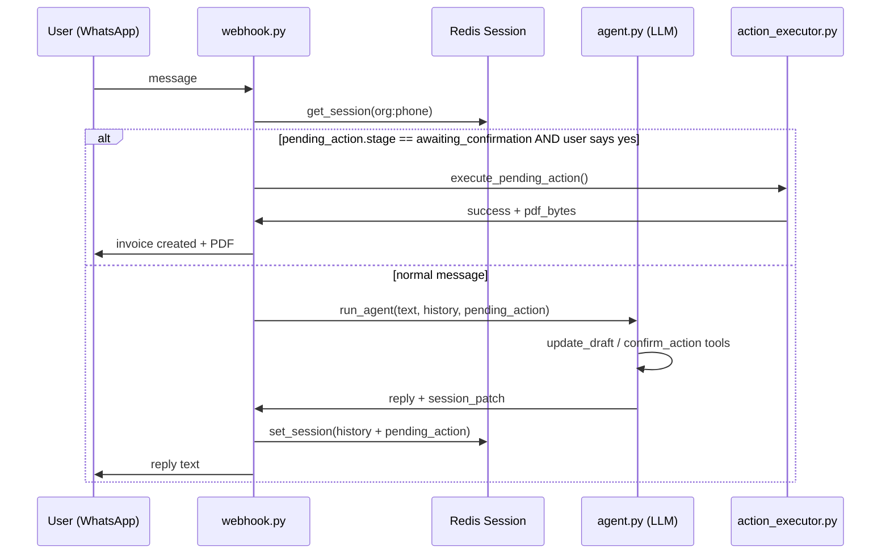

# Invoice & Quotation Data Entry — Context, Memory & Flow Fix Guide

**Date:** 30 Jun 2026  
**Scope:** WhatsApp agent (`agent.py`), webhook session handling (`webhook.py`), action executor (`action_executor.py`), workflows, prompts  
**Goal:** Robust multi-turn invoice/quotation creation with proper memory, no hallucinated prefills, single confirmation, and reliable PDF generation.

---

## Table of Contents

1. [Executive Summary](#1-executive-summary)
2. [Production Incidents Observed](#2-production-incidents-observed)
3. [Architecture Overview](#3-architecture-overview)
4. [Root Cause Analysis](#4-root-cause-analysis)
5. [Required Code Changes](#5-required-code-changes)
6. [Prompt & Workflow Alignment](#6-prompt--workflow-alignment)
7. [Session & Memory Design (Target State)](#7-session--memory-design-target-state)
8. [Invoice Flow Specification](#8-invoice-flow-specification)
9. [Quotation Flow Specification](#9-quotation-flow-specification)
10. [PDF Generation Rules](#10-pdf-generation-rules)
11. [Test Scenarios & Edge Cases](#11-test-scenarios--edge-cases)
12. [Implementation Checklist](#12-implementation-checklist)
13. [Verification Checklist Before Deploy](#13-verification-checklist-before-deploy)

---

## 1. Executive Summary

The current system has the **right building blocks** (`update_draft`, `pending_action`, `confirm_action`, `execute_pending_action`) but they are **not wired together correctly**. The result:

| Symptom | Root cause |
|---------|------------|
| Bot prefills Jain Gold Works / 22kt chain when user only says "create invoice" | Stale Redis session + prompt/DB sample leakage + no "empty draft only" guard |
| User must say "yes" twice | `confirm_action` never sets `stage=awaiting_confirmation` on the merged draft; webhook bypasses executor |
| LLM asks to confirm, then system asks again | Two confirmation layers: informal LLM text + formal `confirm_action` tool |
| Multi-turn details lost between messages | `pending_action` never injected into LLM context; confirm text not saved to history |
| Session "forgets" mid-flow | `set_session` overwrites entire session (drops `conversation_history`); 10-min TTL too short |
| OTP threshold skipped for item-based invoices | `execute_pending_action` checks `fields.amount` but draft only has `items[].total` |
| Quotation logic contradicts itself | `jewellery.txt` = rate/SKU calculation; `action_executor` = items array; adapter = metal/weight |

**Fix strategy:** Make `pending_action` the **single source of truth** for in-progress data entry. Inject it into every agent call. Fix stage transitions so webhook executes on first "yes". Save assistant confirm prompts to history. Align quotation to one canonical path.

---

## 2. Production Incidents Observed

### Incident A — Hallucinated prefill on empty request

```
User:  I want to create a invoice
Bot:   Let's create an invoice for Jain Gold Works...
       Item: 22kt gold chain, 60g, 1 piece
       Unit Price: Rs.3,30,000
       Please confirm...
```

**User provided zero details.** Bot invented customer, item, and price.

**Likely contributors (all three can combine):**

1. **Stale Redis session** — Previous test conversation (`Jain Gold Works, 22kt gold chain 60g...`) still in `conversation_history` or `pending_action`.
2. **Prompt contamination** — System prompt and `jewellery.txt` contain ~15 examples featuring "Jain Gold Works" and "22kt gold chain 60g" at Rs.3,30,000 (see `agent.py` RULE 6/8 examples).
3. **DB schema samples** — `_get_schema()` embeds 2 live rows per table; customers/orders/invoices samples include Jain Gold Works and similar items. LLM treats samples as "current task context."

### Incident B — Double confirmation loop

```
User:  Jain Gold Works, 22kt gold chain 60g, 1 piece at 330000
Bot:   Please confirm if all of this is correct...
User:  yes
Bot:   ⚠️ Confirm Action — Create invoice for Jain Gold Works...
User:  yes
Bot:   ⚠️ Confirm Action — (same thing again)
```

**Production logs confirm:** On "yes", agent runs again (`Starting agent for: yes`) instead of webhook calling `execute_pending_action`.

```
[AGENT] Executing tool: confirm_action
[WEBHOOK] From: ... | Message: yes
[AGENT] Starting agent for: yes          ← should NOT happen if stage is correct
[AGENT] Executing tool: update_draft
[AGENT] Executing tool: confirm_action   ← second confirm prompt
```

---

## 3. Architecture Overview



**Intended design:** LLM collects fields → `update_draft` merges into `pending_action` → `confirm_action` sets stage → user "yes" → **webhook short-circuits to executor** (no LLM).

**Actual broken path:** Stage stays `"collecting"` after `confirm_action` → webhook sends "yes" back to LLM → loop repeats.

---

## 4. Root Cause Analysis

### 4.1 `pending_action` never injected into LLM context

**File:** `app/services/agent.py` — `run_agent()`

`pending_action` is passed as a parameter but **never added to `messages` or system prompt**. The LLM only sees `conversation_history` (stripped text) and the current user message.

```python
# Current — pending_action is ignored by the model
messages = [{"role": "system", "content": system_prompt}]
if conversation_history:
    messages.extend(conversation_history)
messages.append({"role": "user", "content": message})
```

**Impact:** On turn 3, LLM cannot reliably know that turn 1 already collected `customer_name=Jain Gold Works`. It re-queries DB, re-parses, or hallucinates.

---

### 4.2 `confirm_action` fails to set `stage=awaiting_confirmation`

**File:** `app/services/agent.py` lines 1167–1173

```python
if pending_action:                          # ← BUG: uses OLD param
    pending_action["stage"] = "awaiting_confirmation"
    session_patch["pending_action"] = pending_action
```

When `update_draft` and `confirm_action` run in the **same iteration**:

1. `update_draft` writes merged draft to `session_patch["pending_action"]` with `stage="collecting"`.
2. `confirm_action` checks `pending_action` (the **original** argument, often `None` or stale).
3. Stage is **never** set to `"awaiting_confirmation"`.
4. Webhook condition `pending_action.get("stage") == "awaiting_confirmation"` is **False**.
5. "yes" goes to LLM again → double confirm.

**Fix:** Always merge from `session_patch.get("pending_action") or pending_action or {}`.

---

### 4.3 Confirmation prompt not saved to conversation history

**File:** `app/services/agent.py` — `_serialize_history()` + confirm return path

When `confirm_action` returns, the visible reply (`⚠️ Confirm Action...`) is sent to the user but **not appended to `messages`** before `_serialize_history()`.

Additionally, `_serialize_history()` **drops** all assistant messages that contain `tool_calls`.

**Impact:** Next turn, history shows user said "yes" but assistant never asked for confirmation in the saved transcript. LLM treats "yes" as ambiguous.

---

### 4.4 Two confirmation layers (LLM text + tool)

System prompt RULE 6 example flow implies:
1. LLM shows summary: *"Please confirm if all of this is correct"*
2. User: *"yes"*
3. LLM calls `confirm_action` → second confirm block

**Rule needed:** When using `update_draft`, the LLM must **NOT** ask for confirmation in plain text. It must go directly to `confirm_action` once all required fields are present. Only **one** confirmation UI — the `⚠️ Confirm Action` block handled by webhook.

---

### 4.5 Session overwrite wipes conversation history

**File:** `app/routers/webhook.py`

Several paths replace the **entire** session dict:

```python
await set_session(session_id, {})                          # cancel — wipes history
await set_session(session_id, {"pending_action": pending_action})  # OTP stage — wipes history
```

**Impact:** Multi-turn flows lose context after OTP transition or cancel/retry.

**Fix:** Always merge: `await set_session(session_id, {**session, "pending_action": ...})`.

---

### 4.6 Session TTL (600s) vs auth TTL (480 min)

**File:** `app/redis_client.py` — default `ttl=600` (10 minutes)

Webhook saves session without passing org TTL:

```python
await set_session(session_id, session)  # uses 600s default
```

Auth token lasts 8 hours; conversation session expires in 10 minutes. User returns after 15 minutes — authenticated but **empty session**.

**Fix:** Pass `ttl=org.session_ttl_minutes * 60` on every `set_session` for normal sessions.

---

### 4.7 `update_draft` tool does not return missing fields

**File:** `app/services/agent.py` — `_execute_tool("update_draft")`

Tool description says *"The response shows what fields are still missing"* but implementation only returns raw field dict. No validation against `entity_schema` from workflows table.

**Impact:** LLM guesses what's missing; inconsistent prompts to user.

**Fix:** Load workflow `entity_schema`, validate merged draft, return structured response:

```json
{
  "type": "draft_update",
  "intent_key": "create_sales_invoice",
  "fields": {...},
  "stage": "collecting",
  "missing_fields": ["items"],
  "complete": false
}
```

---

### 4.8 OTP threshold uses wrong field

**File:** `app/services/action_executor.py` line 57

```python
amount = fields.get("amount") or 0
```

Invoice drafts store total inside `items[].total`, not top-level `amount`. A Rs.3,39,900 invoice **skips OTP** when threshold is Rs.50,000.

**Fix:**

```python
def _resolve_amount(fields: dict) -> float:
    if fields.get("amount"):
        return float(fields["amount"])
    items = fields.get("items") or []
    return sum(float(i.get("total", 0)) for i in items)
```

Use `_resolve_amount(fields)` for OTP and approval checks.

---

### 4.9 Schema sample data leakage

**File:** `app/services/agent.py` — `_get_schema()`

Embeds live DB rows in system prompt (40KB+ prompt). Sample customers include Jain Gold Works; orders include "22kt gold chain".

**Fix options (pick one or combine):**

- **A.** Remove sample rows from agent prompt; keep column types only.
- **B.** Replace samples with anonymized static examples.
- **C.** Add explicit rule: *"Schema samples are reference only. NEVER use sample row values as user input."*

---

### 4.10 Quotation flow — three conflicting implementations

| Source | Model | Required inputs |
|--------|-------|-----------------|
| `jewellery.txt` SECTION G | Rate-based: SKU + weight + metal → calculate → `generate_pdf` directly | customer, design_code, weight_grams, metal_type |
| `workflows` entity_schema | Items array (same as invoice) | customer_id, items[] |
| `action_executor._create_quotation` | Items array → `quotations` table | customer_id, items[] |
| `adapters/quotation.py` | Rate-based → `pricing` table | customer, metal_type, weight_grams, design_code |
| `agent.py generate_pdf` | Rate-based insert to `pricing` | extra_context with metal_type |

**Impact:** User says *"quote Jain Gold Works 22kt chain 60g 330000"* — agent may use items path or rate path unpredictably.

**Decision needed (recommended):** Support **two quotation modes**:

1. **Manual quote** — user gives lump-sum/items (like invoice) → `quotations` table + PDF.
2. **Calculated quote** — user gives SKU + weight + metal → rate lookup → `pricing` table + PDF.

Both use `update_draft` + `confirm_action` + executor. Mode detected from fields present.

---

### 4.11 Workflow `llm_system_prompt` stale vs `entity_schema`

DB workflow for `create_sales_invoice` still says:

> Required entities: **customer_name** and **amount**

But `entity_schema` (migration 009) requires **items[]** array, not `amount`.

**Impact:** LLM asks for "amount" in one turn, builds items in another; executor rejects if items missing.

**Fix:** Update `llm_system_prompt` in DB to match items-based schema.

---

### 4.12 No guard against inventing user data

Missing explicit rule:

> **NEVER populate draft fields from schema samples, example prompts, previous unrelated conversations, or database query results unless the user's current or prior messages in THIS conversation explicitly stated those values.**

Add to system prompt and enforce in `update_draft` validator (reject fields with no user-message source in `raw_text` accumulation).

---

## 5. Required Code Changes

### 5.1 `agent.py` — Inject pending draft into context

Add before building `messages`:

```python
def _format_pending_action_context(pending_action: dict | None) -> str:
    if not pending_action:
        return ""
    fields = pending_action.get("fields") or {}
    return (
        "\n=== ACTIVE DRAFT (from this conversation — do NOT discard or replace unless user changes it) ===\n"
        f"Intent: {pending_action.get('intent_key')}\n"
        f"Stage: {pending_action.get('stage', 'collecting')}\n"
        f"Collected fields: {json.dumps(fields, default=str)}\n"
        "Only ask for fields NOT listed above. Never invent values not provided by the user.\n"
        "=== END ACTIVE DRAFT ===\n"
    )
```

In `run_agent()`:

```python
draft_context = _format_pending_action_context(pending_action)
system_with_draft = system_prompt + draft_context if draft_context else system_prompt
messages = [{"role": "system", "content": system_with_draft}]
```

---

### 5.2 `agent.py` — Fix confirm_action stage merge

Replace lines 1167–1173:

```python
if tool_call.function.name == "confirm_action":
    if isinstance(result, dict) and result.get("type") == "confirm_pending":
        draft = session_patch.get("pending_action") or pending_action or {}
        draft["stage"] = "awaiting_confirmation"
        # Ensure intent_key and fields preserved from update_draft in same turn
        session_patch["pending_action"] = draft
```

---

### 5.3 `agent.py` — Save confirm prompt to history

Before return in confirm_action block:

```python
confirm_text = "\n".join(lines)
history_to_save = _serialize_history(messages)
history_to_save.append({"role": "assistant", "content": confirm_text})
return confirm_text, history_to_save, session_patch
```

Apply same pattern for normal text responses (append final assistant content).

---

### 5.4 `agent.py` — Enhance `update_draft` with schema validation

```python
async def _validate_draft(intent_key: str, fields: dict, org_id: str) -> dict:
    wf = await fetch_one(
        "SELECT entity_schema FROM workflows WHERE intent_key=$1 AND org_id=$2 AND is_active=true",
        intent_key, org_id
    )
    schema = wf.get("entity_schema") or {}
    if isinstance(schema, str):
        schema = json.loads(schema)

    missing = []
    for field_name, field_def in schema.items():
        if not field_def.get("required"):
            continue
        val = fields.get(field_name)
        if val is None or val == "" or val == []:
            missing.append(field_name)

    return {"missing_fields": missing, "complete": len(missing) == 0}
```

In `_execute_tool("update_draft")`, after merge logic in `run_agent`, include validation result in tool response.

---

### 5.5 `agent.py` — Block confirm if draft incomplete

In `confirm_action` handler inside `run_agent`, before returning confirm prompt:

```python
validation = await _validate_draft(
    session_patch.get("pending_action", {}).get("intent_key"),
    session_patch.get("pending_action", {}).get("fields", {}),
    user["org_id"]
)
if not validation["complete"]:
    # Don't confirm — let LLM ask for missing fields
    messages.extend(tool_results)
    continue  # next iteration
```

Or return error tool result: `"ERROR: Cannot confirm — missing: items"`.

---

### 5.6 `agent.py` — Intent-only message fast path (optional but recommended)

When message matches `r'(?i)(create|make|new|banao).{0,20}(invoice|bill)'` and no customer/amount in message and no pending draft:

Skip LLM inventing data; return deterministic response:

```python
"I'll help you create an invoice. Please provide:\n"
"1. *Customer name*\n"
"2. *Item description* (e.g. 22kt gold chain 60g)\n"
"3. *Quantity*\n"
"4. *Unit price* (ex-GST)\n\n"
"_You can send all details in one message or step by step._"
```

And call `update_draft(intent_key="create_sales_invoice", fields={})`.

---

### 5.7 `webhook.py` — Merge session, don't replace

Replace all `set_session(session_id, {})` with:

```python
session.pop("pending_action", None)
session.pop("state", None)
await set_session(session_id, session, ttl=ttl_minutes * 60)
```

Replace `set_session(session_id, {"pending_action": pending_action})` with:

```python
await set_session(session_id, {**session, "pending_action": pending_action}, ttl=ttl_minutes * 60)
```

---

### 5.8 `webhook.py` — Append execution result to history

After successful `execute_pending_action`:

```python
session["conversation_history"] = (session.get("conversation_history") or []) + [
    {"role": "user", "content": text},
    {"role": "assistant", "content": reply}
]
session["conversation_history"] = session["conversation_history"][-15:]
```

---

### 5.9 `webhook.py` — Broaden "yes" detection for confirmation

Current: `("yes", "y", "haan", "ha", "ok", "confirm")`

Add: `"yes confirm"`, `"haan bhai"`, `"theek hai"`, `"sahi hai"`, `"go ahead"`, `"proceed"`, `"👍"`

**Important:** Only match these when `stage == "awaiting_confirmation"`. Do NOT intercept "yes" during `collecting` stage (user might be answering "do you want GST included? yes").

---

### 5.10 `action_executor.py` — Fix amount resolution

```python
def _resolve_amount(fields: dict) -> float:
    if fields.get("amount") is not None:
        return float(fields["amount"])
    total = 0.0
    for item in fields.get("items") or []:
        total += float(item.get("total") or 0)
    return total
```

Use in OTP check, approval check, and audit log.

---

### 5.11 `action_executor.py` — Set `created_by` on invoice insert

Current INSERT omits `created_by`. Schema supports it.

```python
INSERT INTO invoices (..., created_by) VALUES (..., $6)
```

---

### 5.12 `_get_schema()` — Reduce hallucination surface

```python
# Option A: columns only, no samples
schema_parts.append(f"- {table}: {', '.join(columns)}")
# Remove sample_lines fetch entirely from agent prompt
```

---

### 5.13 New helper: `draft_service.py` (recommended)

Centralize draft logic:

- `merge_draft(existing, new_fields) -> dict`
- `validate_draft(intent_key, fields, org_id) -> {missing, complete}`
- `compute_missing_prompt(missing, intent_key) -> str`
- `detect_intent_reset(message) -> bool` — "cancel", "new invoice", "start over"

---

## 6. Prompt & Workflow Alignment

### 6.1 System prompt additions (`agent.py` / `_base.txt`)

Add under RULE 6:

```
RULE 6B — NEVER INVENT DATA:
If the user says only "create invoice" or "invoice banao" with NO customer, item, or amount:
  → Call update_draft with empty fields
  → Ask ONLY for missing required fields
  → Do NOT use example names (Jain Gold Works, Mehta Enterprises) from this prompt
  → Do NOT use schema sample rows as invoice data
  → Do NOT pull items from orders/inventory unless user asked

RULE 6C — SINGLE CONFIRMATION:
When all required fields are collected:
  → Call update_draft with stage="awaiting_confirmation"
  → Immediately call confirm_action
  → Do NOT also ask "Please confirm if this is correct" in plain text
  → The ONLY confirmation the user sees is the ⚠️ Confirm Action block
```

### 6.2 Update DB workflow `llm_system_prompt`

```sql
UPDATE workflows
SET llm_system_prompt = '
This workflow CREATES a new sales invoice.
Required: customer_name (resolve to customer_id), items[] array.
Each item: description, qty, unit_price, gst, total.
Optional top-level amount is derived from sum of item totals.
Multi-turn: use update_draft to accumulate fields across messages.
When complete: confirm_action once. Do not ask for confirmation in plain text.
'
WHERE intent_key = 'create_sales_invoice';
```

### 6.3 Resolve quotation prompt conflict in `jewellery.txt`

Split into two clearly labelled sections:

```
QUOTATION MODE A — CALCULATED (SKU + weight + metal):
  ...existing rate-based flow...

QUOTATION MODE B — MANUAL (user gives price/items):
  Same as invoice items flow but intent_key = generate_price_quotation
  Use update_draft + confirm_action + action_executor
```

Remove contradictory line: *"Do NOT call confirm_action - generate PDF directly"* for Mode B.

---

## 7. Session & Memory Design (Target State)

### Redis session structure

```json
{
  "conversation_history": [
    {"role": "user", "content": "create invoice"},
    {"role": "assistant", "content": "I need: customer name, items..."},
    {"role": "user", "content": "Jain Gold Works, 22kt chain 60g, 1 pc, 330000"},
    {"role": "assistant", "content": "⚠️ Confirm Action\n\nCreate invoice..."}
  ],
  "pending_action": {
    "intent_key": "create_sales_invoice",
    "stage": "awaiting_confirmation",
    "fields": {
      "customer_id": "cc111111-0000-0000-0000-000000000006",
      "customer_name": "Jain Gold Works",
      "items": [{"description": "22kt gold chain 60g", "qty": 1, "unit_price": 330000, "gst": 9900, "total": 339900}]
    },
    "field_sources": {
      "customer_name": "turn_2",
      "items": "turn_2"
    },
    "created_at": "2026-06-30T12:00:00",
    "updated_at": "2026-06-30T12:01:00"
  },
  "last_message": "yes"
}
```

### Memory rules

| Rule | Value |
|------|-------|
| History window | **15 messages** (~7–8 turns) — keep as-is |
| TTL | Match `orgs.session_ttl_minutes` (default 480 min) |
| Draft persistence | Lives in `pending_action` until executed, cancelled, or intent reset |
| Intent reset triggers | "cancel", "stop", "new invoice", "different customer" |
| What LLM sees each turn | system prompt + **ACTIVE DRAFT block** + history + current message |

### Stage machine

```
[none] ──create invoice──► collecting
collecting ──all fields──► awaiting_confirmation  (via confirm_action tool)
awaiting_confirmation ──yes──► [webhook executes] ──► done (pending_action cleared)
awaiting_confirmation ──no──► cleared
collecting ──cancel──► cleared
awaiting_confirmation ──amount≥OTP threshold──► awaiting_otp ──OTP ok──► execute
```

---

## 8. Invoice Flow Specification

### Required fields (from workflow entity_schema)

| Field | Type | Source |
|-------|------|--------|
| `customer_name` | string | User message → DB lookup → `customer_id` |
| `customer_id` | uuid | Resolved via two-pass customer lookup |
| `items[]` | array | User message |
| `items[].description` | string | User |
| `items[].qty` | int | User (default 1 if "1 piece") |
| `items[].unit_price` | float | User (ex-GST) |
| `items[].gst` | float | Calculate: `unit_price * qty * gst_rate/100` |
| `items[].total` | float | `unit_price * qty + gst` |

### GST calculation

Org GST rate from `orgs.gst_rate` (default 3.0%):

```python
gst_rate = org.gst_rate  # 3.0
line_subtotal = unit_price * qty
gst = round(line_subtotal * gst_rate / 100, 2)
total = line_subtotal + gst
```

### Multi-turn behaviour

| Turn | User says | Expected bot behaviour |
|------|-----------|------------------------|
| 1 | "create invoice" | Ask for customer + items. `update_draft(fields={})`. **No invented data.** |
| 2 | "Jain Gold Works" | "Got customer Jain Gold Works (Ahmedabad). What items?" Draft: `{customer_id, customer_name}` |
| 3 | "22kt chain 60g" | "Got item. Quantity and price?" Draft adds partial item |
| 4 | "1 piece, 330000" | Build item with GST. `confirm_action`. Single ⚠️ block |
| 5 | "yes" | Webhook executes. Invoice + PDF. **No LLM call** |

### One-shot behaviour

| User says | Expected |
|-----------|----------|
| "Jain Gold Works 22kt chain 60g 1 piece 330000 invoice banao" | Resolve customer → build items → single confirm → done |

### Partial overlap with existing order

User may reference order: *"invoice for ORD-1005"*

- Query `orders` for ORD-1005
- Prefill customer + description + estimated_amount from order row (this is **explicit user reference**, not hallucination)
- Still confirm before create

---

## 9. Quotation Flow Specification

### Mode A — Calculated (SKU + weight + metal)

**Trigger phrases:** `"quote Mehta GC-22K-001 15g 22kt"`, `"estimate Jain Gold Works 22kt 60g GC-22K-001"`

**Steps:**
1. `update_draft(intent_key="generate_price_quotation", fields={mode: "calculated", ...})`
2. Lookup customer, inventory SKU, pricing rate
3. Calculate metal_cost, making, GST, total
4. `confirm_action` with breakdown
5. On yes → executor or `generate_pdf` with `doc_type=quotation` + insert to `pricing`/`quotations`

### Mode B — Manual (items/price)

**Trigger phrases:** `"quote Jain Gold Works 22kt chain 60g at 330000"`, same shape as invoice

**Steps:** Identical to invoice flow but `intent_key="generate_price_quotation"`, inserts to `quotations` table, PDF title `"Price Quotation — QUO-XXXX"`.

### Mode detection logic

```python
if design_code and weight_grams and metal_type:
    mode = "calculated"
elif items or (description and unit_price):
    mode = "manual"
else:
    mode = "unknown"  → ask clarifying question
```

---

## 10. PDF Generation Rules

### After invoice/quotation creation (write path)

- PDF generated inside `action_executor._create_invoice` / `_create_quotation`
- Sent by webhook after success (`result.pdf_bytes`)
- **Do not** require user to say "pdf" for newly created documents

### Read path (existing data)

- User queries data → text response + footer *"Reply pdf"*
- User says "pdf" → `generate_pdf` tool

### Test IDs from seed data

| Query | Expected doc_type |
|-------|-------------------|
| "paid invoices pdf" | report |
| "send INV-104 pdf" | invoice (single) |
| "Mehta Enterprises dues statement pdf" | statement |
| "ready orders pdf" | orders |
| After creating quotation | quotation (auto-sent) |

---

## 11. Test Scenarios & Edge Cases

### Pre-test setup

1. Clear Redis session for test phone: delete key `session:{org_id}:{phone}`
2. Or send: `"retry"` / `"start over"` after implementing intent reset
3. Note current invoice count for INV number prediction
4. Test phone must be registered in `users` table

---

### Group 1 — Memory & context

| # | Scenario | Steps | Expected | Fail if |
|---|----------|-------|----------|---------|
| M1 | Clean slate intent | Clear session. Send: `"create invoice"` | Asks for customer + items. **No customer name prefilled** | Jain Gold Works or any name appears |
| M2 | Two-step customer | M1 → `"Jain Gold Works"` | Acknowledges customer, asks for items only | Asks for customer again |
| M3 | Three-step items | M2 → `"22kt chain 60g"` → `"1 pc 330000"` | Draft accumulates; one confirm | Loses customer from turn 2 |
| M4 | History after PDF query | Ask `"ready orders"` → `"pdf"` → `"create invoice"` | Invoice flow fresh, no order data in draft | Order details leak into invoice |
| M5 | Session TTL | Start invoice, wait 11 min (before fix) / 2 hr (after fix) | After fix: draft persists within org TTL | Draft lost while still authenticated |
| M6 | Cancel mid-flow | Partial draft → `"cancel"` | Draft cleared, friendly ack | Old draft persists |
| M7 | Intent switch | `"create invoice"` → `"actually make a quote for Sharma"` | Quotation draft replaces invoice draft | Mixed fields |

---

### Group 2 — Invoice creation

| # | Scenario | Input | Expected |
|---|----------|-------|----------|
| I1 | One-shot English | `Jain Gold Works, 22kt gold chain 60g, 1 piece at 330000 — invoice` | GST calc → single ⚠️ confirm → INV created + PDF |
| I2 | One-shot Hinglish | `Jain Gold Works ka bill banao 22kt chain 60g ek piece 330000` | Same as I1 |
| I3 | Amount in lakhs | `Mehta Enterprises 2 lakh invoice, 22kt bangle set 1 pc` | Amount = 200000, confirm shows correctly |
| I4 | Missing price | `invoice for Sharma Ornaments, 18kt pendant 12g qty 1` | Ask **only** for price |
| I5 | Missing customer | `invoice 22kt chain 60g 330000` | Ask **only** for customer |
| I6 | Unknown customer | `invoice for Kapoor Traders 50000` | Customer not found message |
| I7 | Ambiguous Mehta | `Mehta ka invoice 92000` | Clarify menu (3 Mehtas) |
| I8 | Specific Mehta | `Mehta Enterprises invoice 92000, gold ring 1 pc` | No clarify, proceeds |
| I9 | Double yes | Complete flow, reply `yes` once | Invoice created immediately. **No second confirm** |
| I10 | No after confirm | Full flow → `no` | "Action cancelled", draft cleared |
| I11 | OTP threshold | Amount > 50000 | OTP email → enter code → invoice created |
| I12 | Below OTP | Amount 25000 | No OTP, direct create |
| I13 | Approval threshold | Amount > 100000 | Approval message (if enabled) |
| I14 | From order ref | `create invoice for ORD-1005` | Prefill Jain Gold Works, chain 30g, ~190000 |
| I15 | Typo invoice | `i want to create a invoice` | Same as M1 — ask for details |

---

### Group 3 — Quotation creation

| # | Scenario | Input | Expected |
|---|----------|-------|----------|
| Q1 | Calculated quote | `quote Jain Gold Works GC-22K-001 15g 22kt` | Rate lookup, breakdown, confirm, QUO pdf |
| Q2 | Manual quote | `quotation Sharma Ornaments 22kt chain 60g 1 pc 330000` | Items-based confirm, QUO in quotations table |
| Q3 | Missing SKU | `quote Mehta 15g 22kt` | Ask for design code |
| Q4 | Missing metal | `quote Mehta GC-22K-001 15g` | Ask for metal type |
| Q5 | Invalid SKU | `quote Mehta INVALID-SKU 15g 22kt` | SKU not found message |
| Q6 | Multi-turn quote | `create quotation` → step by step | Draft accumulates like invoice |
| Q7 | Quote vs invoice | `Jain Gold Works 330000` (ambiguous) | Clarify: invoice or quotation? |

---

### Group 4 — PDF (read path)

| # | Scenario | Input | Expected |
|---|----------|-------|----------|
| P1 | List then pdf | `pending orders` → `pdf` | PDF sent, title "Pending Production Orders" |
| P2 | Paid invoices pdf | `give me pdf of all paid invoices` | Report PDF, no new DB writes |
| P3 | Single invoice | `INV-104 pdf` | Tax Invoice doc_type |
| P4 | No pdf keyword | `show overdue invoices` | Text only + pdf footer |
| P5 | New invoice pdf | Complete I1 | PDF auto-sent with creation |

---

### Group 5 — Edge cases & abuse

| # | Scenario | Input | Expected |
|---|----------|-------|----------|
| E1 | Duplicate webhook | Same msg_id twice | Dedup skips second |
| E2 | "yes" during collecting | Bot asks "quantity?" → user: `yes` | Not treated as confirm |
| E3 | Mixed language | `invoice banao Jain Gold Works 60g chain ek piece 330000` | Parsed correctly |
| E4 | Zero qty | `qty 0` | Validation error, re-ask |
| E5 | Negative price | `-5000` | Validation error |
| E6 | Restart after fail | OTP fail → `retry` | Clean session, user can restart |
| E7 | Long conversation | 10+ turns of queries then invoice | Last 15 msgs in context; draft intact |

---

### Manual test script (copy-paste sequence)

**Test A — Happy path one-shot**
```
create invoice for Jain Gold Works — 22kt gold chain 60g, 1 piece, 330000
yes
```
✅ Expect: one confirm, INV-XXX, PDF received

**Test B — Multi-turn**
```
create invoice
Jain Gold Works
22kt gold chain 60g, 1 piece at 330000
yes
```

**Test C — Anti-hallucination**
```
[cancel/retry to clear session]
create invoice
```
✅ Expect: generic "need customer, items" — **zero** prefilled names

**Test D — Double confirm regression**
```
Jain Gold Works, 22kt gold chain 60g, 1 piece at 330000
yes
```
✅ Expect: invoice created on first "yes" — **not** second confirm block

---

## 12. Implementation Checklist

### P0 — Must fix before next deploy (blocks production use)

- [ ] Fix `confirm_action` stage merge bug (`session_patch` not `pending_action`)
- [ ] Inject `pending_action` into system prompt each turn
- [ ] Save confirm prompt to `conversation_history`
- [ ] Merge session on all `set_session` calls (never wipe history)
- [ ] Fix `_resolve_amount()` for OTP/approval thresholds
- [ ] Add RULE 6B/6C to system prompt (no invent, single confirm)

### P1 — High priority (robust data entry)

- [ ] `update_draft` returns `missing_fields` from entity_schema validation
- [ ] Block `confirm_action` when draft incomplete
- [ ] Align workflow `llm_system_prompt` with items schema
- [ ] Session TTL = org.session_ttl_minutes
- [ ] Append execution result to history after webhook executes

### P2 — Quality & quotation clarity

- [ ] Remove or anonymize schema samples in `_get_schema()`
- [ ] Split quotation Mode A / Mode B in prompts
- [ ] Intent reset handler ("cancel", "start over")
- [ ] `field_sources` tracking in draft
- [ ] Unit tests for draft merge/validate/stage machine

### P3 — Nice to have

- [ ] `draft_service.py` extraction
- [ ] Structured logging: `[DRAFT] intent=... stage=... missing=[...]`
- [ ] Admin command to clear session
- [ ] pytest suite from Group 1–5 scenarios

---

## 13. Verification Checklist Before Deploy

After implementing P0+P1, verify in Railway logs:

```
# Good log pattern for "yes" after confirm:
[WEBHOOK] From: ... | Message: yes
[EXECUTOR] Creating invoice for Jain Gold Works
# NO line: [AGENT] Starting agent for: yes

# Good log pattern for empty "create invoice":
[AGENT] Executing tool: update_draft
[AGENT] No tool calls, returning text response
# Response asks for fields — NO customer name in reply
```

Redis inspection (Railway console):
```bash
GET session:11111111-0000-0000-0000-000000000001:+919372860852
# Should show pending_action.stage = "awaiting_confirmation" after confirm
```

Database verification:
```sql
SELECT invoice_number, customer_id, amount, items
FROM invoices
ORDER BY created_at DESC LIMIT 1;
-- items jsonb should match user-provided description
```

---

## Appendix A — File reference map

| File | Role in data entry flow |
|------|-------------------------|
| `app/services/agent.py` | LLM loop, tools, draft/confirm, history serialization |
| `app/routers/webhook.py` | Session load/save, yes/no intercept, PDF send after execute |
| `app/services/action_executor.py` | Deterministic DB write + PDF for invoice/quotation |
| `app/redis_client.py` | Session storage (TTL) |
| `app/prompts/_base.txt` | Core agent rules |
| `app/prompts/jewellery.txt` | Domain glossary (quotation conflict here) |
| `workflows` table | entity_schema, OTP/approval thresholds |
| `customers (4).json` | Seed customers for testing disambiguation |
| `inventory (2).json` | SKUs for calculated quotation tests |

---

## Appendix B — Seed data quick reference

**Customers for disambiguation tests:**
- Mehta Enterprises (Pune), Mehta Diamond Palace (Nagpur), Mehta & Sons (Nashik)
- Sharma Ornaments (Jaipur), Sharma Fine Jewels (Lucknow)
- Jain Gold Works (Ahmedabad)

**Orders for order-to-invoice test:**
- ORD-1005 — Jain Gold Works — 22kt gold chain, 30g — Rs.1,90,000
- ORD-1006 — Mehta Diamond Palace — 22kt necklace with ruby, 60g

**Inventory SKUs for quotation:**
- GC-22K-001 — 22kt Gold Chain — Classic Box Link
- DP-18K-001 — 18kt Diamond Pendant

**Thresholds (from workflows):**
- OTP: Rs.50,000
- MD approval: Rs.1,00,000

---

*This document is analysis + specification only. Implement P0 items first, deploy, run Test C and Test D before broader edge-case testing.*
